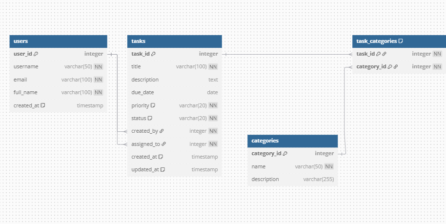

# Task Management System

A comprehensive web-based Task Management System for NovaTech Solutions, designed to help employees track tasks, manage deadlines, and improve productivity through structured workflow management.

## Table of Contents
- [Features](#features)
- [Project Architecture](#project-architecture)
- [Database Schema](#database-schema)
- [Technology Stack](#technology-stack)
- [Setup & Installation](#setup--installation)
- [Usage Guide](#usage-guide)
- [API Documentation](#api-documentation)
- [Contributing](#contributing)

## Features

### User Management
- User registration and authentication
- Profile management
- Role-based access control

### Task Management
- Create, read, update, and delete tasks
- Task assignment to team members
- Status tracking (Pending, In Progress, Completed)
- Priority levels (Low, Medium, High, Urgent)
- Due date management with visual indicators

### Category System
- Group tasks by categories
- Filter tasks by multiple categories
- Manage categories (create, edit, delete)

### Dashboard & Reports
- Overview of tasks by status
- Task filtering by multiple parameters
- Responsive UI for desktop and mobile

## Project Architecture

The application follows a typical multi-layered architecture:

1. **Presentation Layer**: JSP/Servlets handling HTTP requests and responses
2. **Business Logic Layer**: Service interfaces and implementations
3. **Data Access Layer**: DAO interfaces and implementations for database operations
4. **Model Layer**: Entity classes representing domain objects

```
┌─────────────────┐
│   Web Browser   │
└────────┬────────┘
         │
┌────────▼────────┐
│   Presentation  │  Servlets, JSP Pages, Filters
│      Layer      │
└────────┬────────┘
         │
┌────────▼────────┐
│  Business Logic │  Service Interfaces & Implementations
│      Layer      │
└────────┬────────┘
         │
┌────────▼────────┐
│   Data Access   │  DAO Interfaces & Implementations
│      Layer      │
└────────┬────────┘
         │
┌────────▼────────┐
│    Database     │  PostgreSQL
└─────────────────┘
```

## Database Schema

The database consists of four main tables with the following relationships:



### Entity Relationships:

1. **Users to Tasks**:
   - One-to-Many: A user can create many tasks (created_by)
   - One-to-Many: A user can be assigned many tasks (assigned_to)

2. **Tasks to Categories**:
   - Many-to-Many: A task can belong to multiple categories, and a category can contain multiple tasks
   - Implemented using the task_categories junction table

### Table Details:

#### Users Table
- **user_id**: Primary key, auto-increment
- **username**: Unique identifier for login
- **email**: Unique email address
- **full_name**: User's full name
- **password**: User's password (stored securely)

#### Tasks Table
- **task_id**: Primary key, auto-increment
- **title**: Task title
- **description**: Detailed task description
- **due_date**: Deadline for task completion
- **priority**: Enum (LOW, MEDIUM, HIGH, URGENT)
- **status**: Enum (PENDING, IN_PROGRESS, COMPLETED)
- **created_by**: Foreign key to users table (creator)
- **assigned_to**: Foreign key to users table (assignee)
- **created_at**: Timestamp of creation
- **updated_at**: Timestamp of last update

#### Categories Table
- **category_id**: Primary key, auto-increment
- **name**: Unique category name
- **description**: Category description

#### Task_Categories Table
- **task_id**: Foreign key to tasks table
- **category_id**: Foreign key to categories table
- Combined primary key (task_id, category_id)

## Technology Stack

### Backend
- Java 11
- Jakarta EE 9 (Servlet 5.0)
- JDBC for database access

### Frontend
- JSP/JSTL for server-side rendering
- Bootstrap 5 for responsive design
- JavaScript for client-side interactions

### Database
- PostgreSQL 12+

### Build & Deployment
- Maven for dependency management
- Tomcat 10 as application server

## Setup & Installation

### Prerequisites

- JDK 11+
- Maven 3.6+
- PostgreSQL 12+
- Apache Tomcat 10.0.x

### Database Setup

1. Create a new PostgreSQL database:
```sql
CREATE DATABASE taskmanagementsystemDb;
```

2. Execute the initialization script:
```bash
psql -U postgres -d taskmanagementsystemDb -f db_init.sql
```

### Application Setup

1. Clone the repository:
```bash
git clone https://github.com/ingabireol/TaskManagementSystem.git
cd TaskManagementSystem
```

2. Configure database connection in `src/main/java/olim/com/taskmanagementsystem/util/DBUtil.java`:
```java
private static final String JDBC_URL = "jdbc:postgresql://localhost:5432/taskmanagementsystemDb";
private static final String JDBC_USER = "your_username";
private static final String JDBC_PASSWORD = "your_password";
```

3. Build the application:
```bash
mvn clean package
```

4. Deploy to Tomcat:
   - Option 1: Copy the WAR file to Tomcat's webapps directory
   - Option 2: Use the Maven Tomcat plugin:
     ```bash
     mvn tomcat7:deploy
     ```

5. Access the application:
```
http://localhost:8080/taskmanagement
```

## Usage Guide

### Default Accounts

The system comes with these sample users:

| Username | Password    | Role       |
|----------|-------------|------------|
| admin    | admin123    | Admin User |
| ingabire | ingabire123 | Developer  |
| olivier  | olivier123  | Developer  |

### Basic Workflow

1. **Login** using provided credentials
2. **Dashboard** displays an overview of tasks
3. **Task Management**:
   - Create new tasks with the "+ New Task" button
   - View task details by clicking on a task title
   - Edit tasks using the edit button
   - Change task status directly from the list or details page
4. **Category Management**:
   - Manage categories from the sidebar menu
   - Assign categories when creating or editing tasks

## API Documentation

The application provides a RESTful API for task operations:

| Endpoint               | Method | Description                 |
|------------------------|--------|-----------------------------|
| `/tasks`               | GET    | List all tasks              |
| `/tasks/{id}`          | GET    | Get task by ID              |
| `/tasks/create`        | POST   | Create a new task           |
| `/tasks/{id}`          | POST   | Update an existing task     |
| `/tasks/{id}`          | DELETE | Delete a task               |
| `/categories`          | GET    | List all categories         |
| `/categories/{id}`     | GET    | Get category by ID          |
| `/categories/create`   | POST   | Create a new category       |
| `/categories/{id}`     | POST   | Update an existing category |
| `/categories/{id}`     | DELETE | Delete a category           |

## Contributing

1. Fork the repository
2. Create a feature branch: `git checkout -b feature/your-feature-name`
3. Commit your changes: `git commit -m 'Add some feature'`
4. Push to the branch: `git push origin feature/your-feature-name`
5. Submit a pull request

## License

This project is licensed under the MIT License.